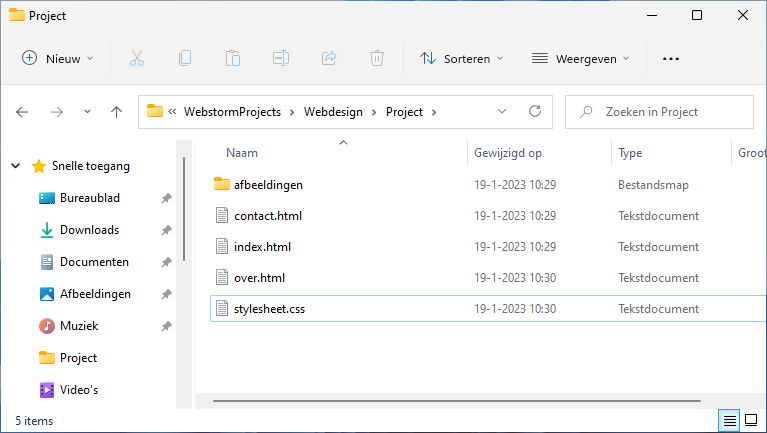
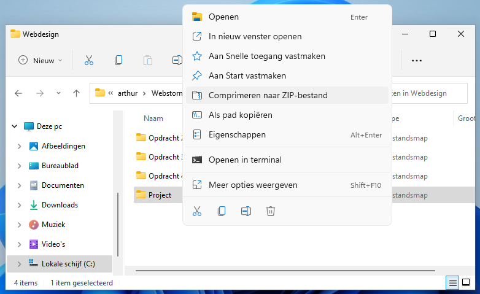
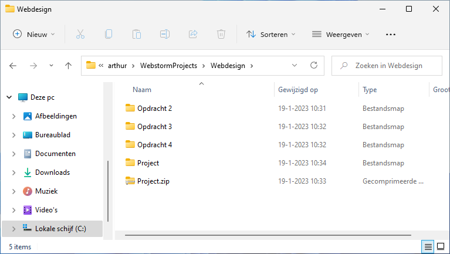
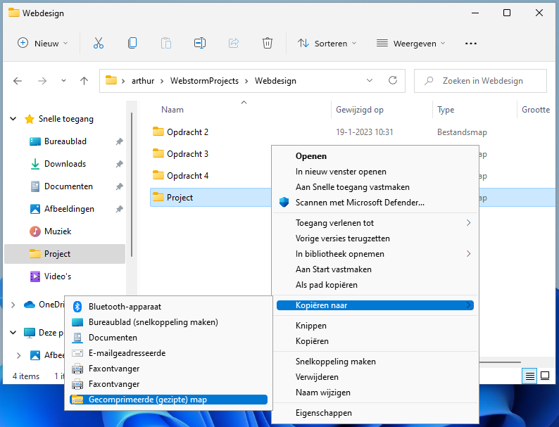

# Meerdere bestanden inleveren

In je [Q-Highschool portfolio](https://app.q-highschool.nl) kun je per module maar één bestand inleveren. Bij informatica heb je vaak meerdere bestanden, bijvoorbeeld omdat je jouw code over meerdere bestanden hebt verdeeld, of omdat je bijvoorbeeld een eindproduct en een verslag in moet leveren. Om dat toch in te kunnen leveren, kun je de bestanden samenvoegen in een `.zip` bestand. Zie hieronder een uitleg voor jouw besturingssysteem.

## Windows 11
1. Zorg dat alle bestanden die je in wilt leveren samen in een mapje staan.
    
    
    
2. Klik met de rechtermuisknop op deze map, en kies *Comprimeren naar ZIP-bestand*.

   
   
3. Er staat nu een `.zip` bestand in de map. Deze kun je inleveren in je Q-Highschool portfolio.

   
   
 ## Windows 10
 
 Zorg net als bij Windows 11 dat alle bestanden samen in een mapje staan. Klik met de rechtermuisknop op de map, en kies de optie *Kopiëren naar* > *Gecomprimeerde (gezipte) map*.
 
 
 
Je hebt nu een `.zip` bestand. Deze kun je inleveren in je Q-Highschool portfolio.

    
Voor fijnproevers: is dat niet een screenshot van Windows 11?

    Ja, dit is een screenshot van Windows 11, maar het menu is zoals je het ook in Windows 10 zou krijgen. Ik had zo snel even geen Nederlandse Windows 10 installatie bij de hand. Je kunt dit menu in Windows 11 overigens vinden door op <i>Meer opties weergeven</i> te klikken, voor het geval je dat ooit nodig mocht hebben.

## macOS

Zorg dat alle bestanden samen in een mapje staan, en klik met de rechtermuisknop (of met twee vingers op je touchpad) op die map. Kies de optie *Comprimeer 'Naam van de map'* en je hebt een `.zip` bestand dat je kunt inleveren in je Q-Highschool portfolio. Kijk op [deze website](https://www.iculture.nl/tips/zip-bestanden-comprimeren-mac/) als je graag een screenshot wilt zien.
